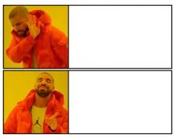

# memer

A meme generator built to **practice Kotlin Multiplatform + Compose Multiplatform** end to end.



Pick a template, drop in draggable text, and **Save / Share / Copy**. Every meme you
create is kept in an in-app **gallery** with its template + text, so you can come
back later and keep editing.

## Why this project exists

This is a learning playground with a clear end goal:

- **Master Compose Multiplatform** — one codebase, real UI on Android and iOS.
- **Learn platform storage** — file system now, a local **database** (SQLDelight/Room)
  next, then syncing.
- **Ship to the stores** — publish the Android app **and** the iOS app to their
  respective App Stores, going through the full release + signing flow on both.
- **Keep both platforms first-class** — write shared logic in `commonMain`, drop to
  `expect`/`actual` only when the OS API demands it.

## What you can do

- Browse a grid of templates, or import your own from the device photo gallery.
- Add multiple draggable, editable text boxes with the classic white-on-black meme style.
- **Save** → stored in your device photos *and* added to the in-app gallery.
- **My Memes** → the gallery: tap any meme to re-open it with its template + text and
  keep editing, or remove it.
- **Share** / **Copy** to any chat app.

## Quick start

| | Android | iOS |
|---|---|---|
| OS | Any | macOS + Xcode 15+ |
| JDK | 11+ | 11+ |
| Kotlin | 2.2.10 | 2.2.10 |

**Android**
```bash
./gradlew :composeApp:assembleDebug
adb install composeApp/build/outputs/apk/debug/composeApp-debug.apk
```
Or open the project in Android Studio and run the `composeApp` configuration.

**iOS** (Mac only)
```bash
# builds the shared Kotlin framework
./gradlew :composeApp:linkDebugFrameworkIosSimulatorArm64
```
Then open `iosApp/iosApp.xcodeproj` in Xcode and press **Cmd+R**.

## How it's built

```
composeApp/src/
  commonMain/   shared UI + logic (Compose, data models, expect API)
  androidMain/  Bitmap/Canvas, MediaStore, FileProvider, Clipboard
  iosMain/      UIImage, Core Graphics, UIActivityViewController, UIPasteboard
  commonTest/   shared unit tests (no device needed)
iosApp/         thin Xcode project hosting the Compose view
```

**Storage**
- Layouts (text boxes) are saved per template as Base64 records
  (`filesDir/templates_state` on Android, `Documents/templates_state` on iOS),
  autosaved while you edit and restored when you return.
- Created memes are persisted in an in-app **gallery** (`gallery/`): each entry stores
  the rendered image plus the template reference and encoded text, so it can be
  re-opened and edited. This is the stepping stone toward the planned local database.

## Tests

```bash
./gradlew :composeApp:testDebugUnitTest
```

Covers the pure shared logic: template catalog, text formatting, file naming,
text-box mapping, and layout encode/decode round-trips.

## Roadmap

- [ ] Replace file-based gallery storage with a local database
- [ ] Template search + categories
- [ ] Android release build + Play Store submission
- [ ] iOS release build + App Store submission
- [ ] Image cropping / text styling options
